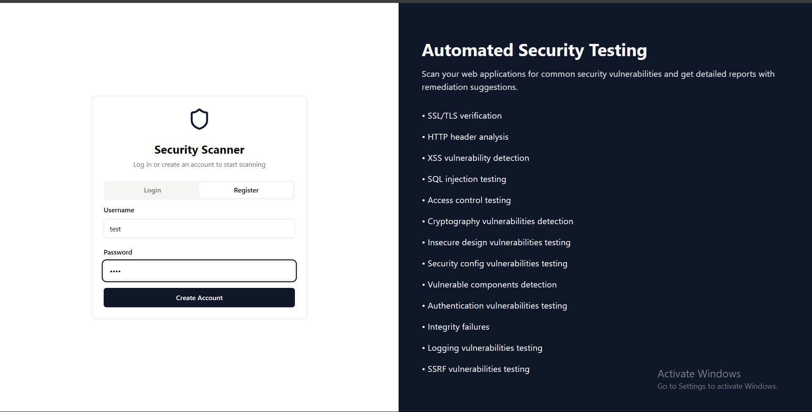
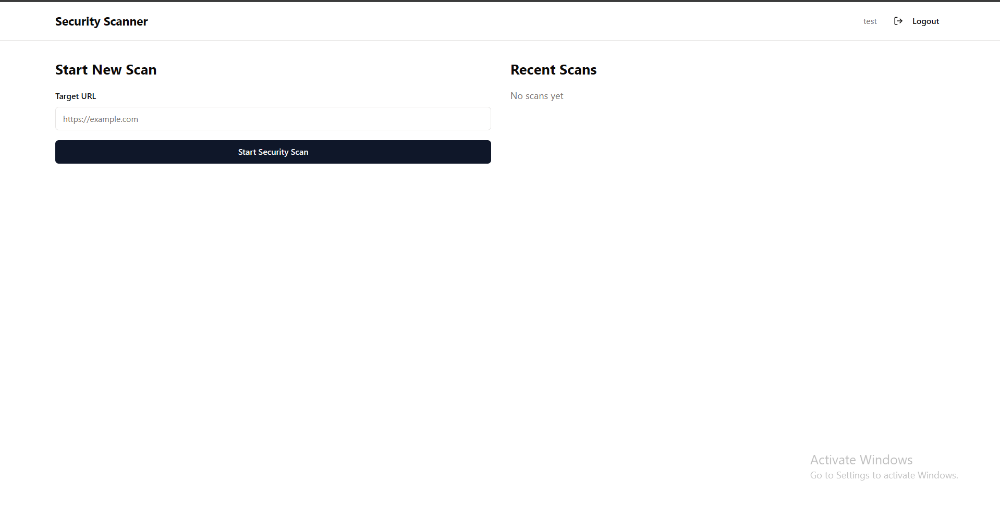
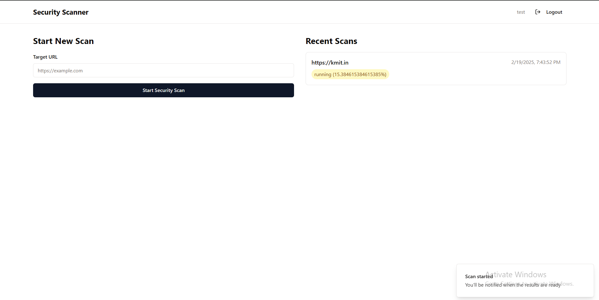
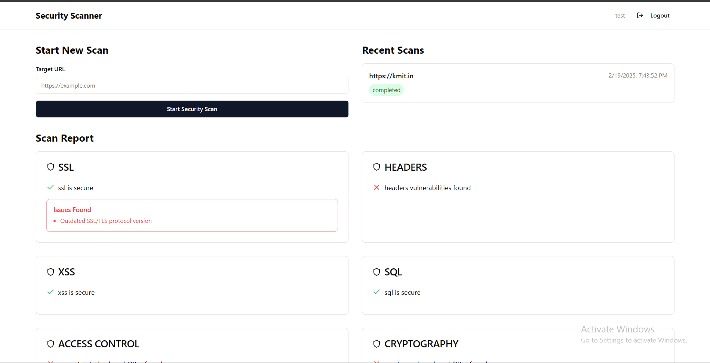
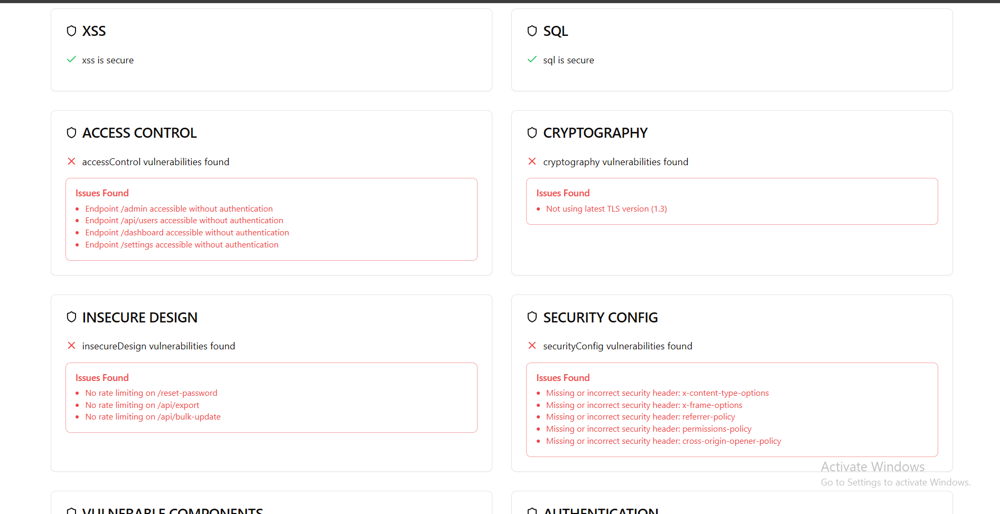
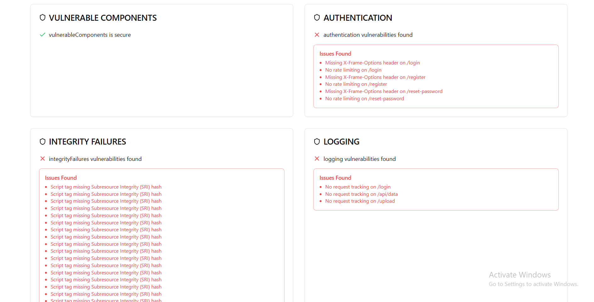

# BugHunterSuite



**BugHunterSuite** is a powerful website security testing suite designed to detect vulnerabilities in web applications. It helps identify critical security flaws such as Broken Access Control, Injection Attacks, Authentication Failures, and more. 

## Features

BugHunterSuite can test websites for the following vulnerabilities:

- **Broken Access Control**: Detects unauthorized access and privilege escalation issues.
- **Cryptographic Failures**: Identifies weak encryption and improper cryptographic implementations.
- **Injection Attacks**: Detects SQL injection, command injection, and other injection flaws.
- **Insecure Design**: Analyzes application logic flaws and weak design patterns.
- **Security Misconfiguration**: Finds improper security settings and default configurations.
- **Vulnerable Components**: Checks for outdated and vulnerable libraries, frameworks, and dependencies.
- **Authentication Failures**: Identifies weak authentication mechanisms and brute-force vulnerabilities.
- **Software and Data Integrity Failures**: Detects tampering risks and improper validation of data integrity.
- **Security Logging and Monitoring Failures**: Flags inadequate logging and monitoring systems.
- **Server-Side Request Forgery (SSRF)**: Detects SSRF vulnerabilities that could lead to data exposure.

## Screenshots

### Home Page


### Authentication Page


### Reports Page





## Installation

```bash
git clone https://github.com/UdaykiranRegimudi/BugHunterSuite.git
cd BugHunterSuite
```

## Usage

Run the tool to start scanning a website:

```bash
python bughunter.py --url https://example.com
```

## Contributing

Contributions are welcome! Feel free to submit issues or pull requests.

## License

This project is licensed under the MIT License.

## Author

Developed by **Uday Kiran Regimudi**

## Repository

[GitHub: BugHunterSuite](https://github.com/UdaykiranRegimudi/BugHunterSuite)
